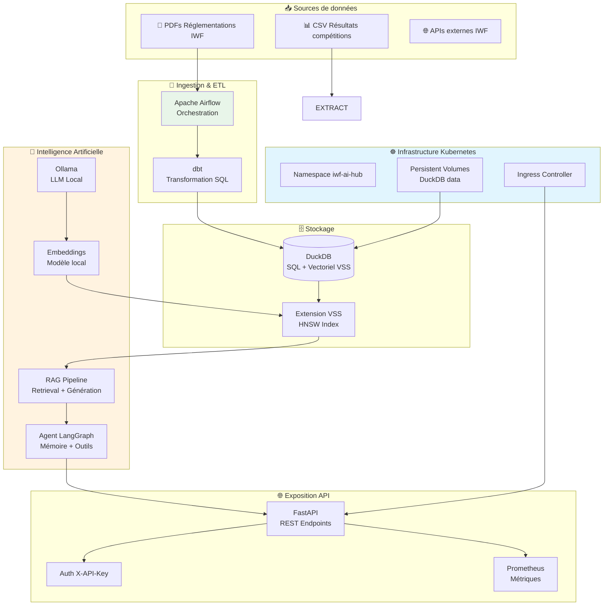

# IWF AI Hub

Plateforme d'intelligence augmentée pour l'International Weightlifting Federation (IWF).
Architecture moderne de Data + IA, migrée de Docker Compose vers Kubernetes pour la scalabilité
et la souveraineté des données.

---

## 🎯 Problème métier

L'IWF gère un volume croissant de données (résultats de compétitions, réglementations anti-dopage,
historiques athlètes) réparties dans des PDFs non structurés et des bases de données hétérogènes.

**Objectifs :**
- Centraliser et structurer les données IWF (ETL moderne)
- Permettre l'interrogation en langage naturel des réglementations (RAG)
- Fournir un agent IA conversationnel pour les analystes et entraîneurs
- Garantir la souveraineté des données (infrastructure on-premise / cloud souverain)

---

## 🏗️ Architecture



---


## 🛠️ Stack Technique

| Composant | Technologie | Rôle | Environnement |
|---|---|---|---|
| Orchestration | Apache Airflow | DAGs ETL, scheduling | Docker / Kubernetes |
| Transformation | dbt + DuckDB | Modélisation Star Schema | .venv-dbt |
| Base de données | DuckDB + VSS | SQL + Vector Search | Container / K8s |
| LLM & Embeddings | Ollama | LLM local, souveraineté | Container / K8s |
| Agent IA | LangGraph | Workflow conversationnel | .venv |
| API | FastAPI | Exposition REST | Container / K8s |
| Conteneurisation | Docker + Compose | Dev local | Local |
| Orchestration | Kubernetes | Production, scalabilité | Minikube / Cluster |
| Packaging | Helm | Déploiement K8s | K8s |
| CI/CD | GitLab CI | Build, test, deploy | GitLab |
| Monitoring | Prometheus/Grafana | Observabilité | K8s |

---

## 📁 Structure du projet

```
iwf-ai-hub/
│
├── 📁 k8s/                             # ⭐ NOUVEAU — Déploiement Kubernetes
│   ├── namespace.yaml                   # Isolation iwf-ai-hub
│   ├── configmap.yaml                   # Variables d'environnement
│   ├── secrets.yaml                     # Credentials (template)
│   ├── duckdb-statefulset.yaml          # Base de données persistante
│   ├── duckdb-service.yaml              # Service interne DuckDB
│   ├── ollama-deployment.yaml           # LLM local
│   ├── ollama-service.yaml
│   ├── airflow-deployment.yaml          # Orchestration
│   ├── api-deployment.yaml              # FastAPI
│   ├── api-service.yaml
│   └── ingress.yaml                     # Exposition externe
│
├── 📁 helm/                             # ⭐ NOUVEAU — Packaging Helm
│   └── iwf-ai-hub/
│       ├── Chart.yaml
│       ├── values.yaml
│       └── templates/
│
├── 📁 .gitlab-ci.yml                    # ⭐ NOUVEAU — CI/CD
│                                       
├── 📁 dags/                             # Airflow Workflows
│   └── dag_etl_results.py               # Pipeline Bronze → Silver → Gold
│                                       
├── 📁 dbt/                              # Transformation Layer
│   ├── dbt_project.yml                  # Project config & materialization settings
│   ├── profiles.yml                     # DuckDB connection profile
│   └── models/                          # SQL transformation models
│       ├── staging/                     # Silver Layer: Cleaning & Typing
│       │   └── stg_results.sql         
│       └── marts/                       # Gold Layer: Star Schema (BI Ready)
│           ├── dim_athletes.sql
│           ├── dim_weight_classes.sql
│           ├── fct_results.sql
│           └── schema.yml               # Data Quality Tests (not_null, unique, etc.)
│
├── 📁 src/                              # Source Code
│   ├── 📁 db/
│   │   └── init.sql                     # VSS Extension installation
│   ├── 📁 pipelines/
│   │   ├── extract_results.py           # Bronze Layer: Data Extraction
│   │   ├── load_pdfs.py                 # ⭐ Phase 3 — Chargement PDFs
│   │   ├── chunking.py                  # ⭐ Phase 3 — Découpage
│   │   ├── embeddings.py                # ⭐ Phase 3 — Vectorisation
│   │   └── retrieval.py                 # ⭐ Phase 3 — Recherche
│   ├── 📁 agent/                        # ⭐ Phase 4 — Agent IA
│   │   ├── llm_config.py
│   │   ├── tools.py
│   │   ├── graph.py
│   │   └── memory.py
│   └── 📁 api/                          # ⭐ Phase 5 — API
│       ├── main.py
│       ├── models.py
│       ├── auth.py
│       └── monitoring.py
│
├── 📁 tests/                            # Tests unitaires & intégration
│   ├── test_etl.py
│   ├── test_rag.py                      # ⭐ Phase 3
│   ├── test_agent.py                    # ⭐ Phase 4
│   └── test_api.py                      # ⭐ Phase 5
│
├── 📁 data/
│   ├── pdfs/                            # Documents IWF
│   └── duckdb/                          # Base de données (volume)
│
├── 📁 requirements/                     # Environnements isolés
│   ├── base.txt
│   ├── airflow.txt
│   ├── dbt.txt
│   └── api.txt
│
├── docker-compose.yaml                  # Dev local (Docker)
├── Dockerfile                           # Custom Airflow + dbt-duckdb
└── README.md                            # Ce fichier
```

---

## Architecture
- **Orchestration** : LangGraph
- **Base de données hybride** : DuckDB (SQL & VSS)
- **LLM & Embeddings** : Ollama (Local)
- **Pipelines** : Apache Airflow
- **API** : FastAPI

## 🚀 Quick Start
### Option 1 : Docker Compose (Développement local)
```bash
# 1. Cloner le repo
git clone https://github.com/gautbl/iwf-ai-hub.git
cd iwf-ai-hub

# 2. Lancer l'infrastructure
docker-compose up -d

# 3. Vérifier les services
curl http://localhost:8080/health  # Airflow
curl http://localhost:11434/api/tags  # Ollama
```

### Option 2 : Kubernetes (Production-like) ⭐
```bash
# 1. Démarrer Minikube
minikube start --driver=docker --memory=4096

# 2. Déployer
kubectl apply -f k8s/namespace.yaml
kubectl apply -f k8s/configmap.yaml
kubectl apply -f k8s/duckdb-statefulset.yaml
kubectl apply -f k8s/duckdb-service.yaml
kubectl apply -f k8s/ollama-deployment.yaml
kubectl apply -f k8s/airflow-deployment.yaml

# 3. Vérifier
kubectl get pods -n iwf-ai-hub
kubectl logs -n iwf-ai-hub deployment/airflow-webserver
```

---

## 📋 Roadmap

Phase | Composant | Statut | Description |
|---|---|---|---|
| Phase 1 | Infrastructure Docker | ✅ Terminé | Airflow, DuckDB, Ollama |
| Phase 2 | Pipeline ETL | ✅ Terminé | dbt, Star Schema, tests |
| Phase 3 | Pipeline RAG | 🚧 En cours | PDFs, chunking, embeddings |
| Phase 4 | Agent LangGraph | ⏳ À venir | Outils, mémoire, workflow |
| Phase 5 | API FastAPI | ⏳ À venir | REST, auth, monitoring |
| Phase 6 | Kubernetes | 🚧 En cours | Migration, Helm, CI/CD |

---

## 🎯 Objectif Professionnel
Ce projet démontre une architecture IA/Data moderne et souveraine, alignée avec les enjeux
de confidentialité et de performance. La migration vers Kubernetes illustre la capacité à
industrialiser une solution IA pour la production à grande échelle.

### Compétences clés mises en avant :

Architecture de données (ETL, modélisation, qualité)
Intelligence artificielle (RAG, LLM local, agents)
DevOps & Infrastructure (Docker, Kubernetes, CI/CD)
Souveraineté des données (on-premise, open source)

---

## 🔗 Liens utiles
DuckDB VSS Extension: https://duckdb.org/docs/extensions/vss
LangGraph Documentation: https://langchain-ai.github.io/langgraph/
Ollama: https://ollama.ai
Kubernetes Documentation: https://kubernetes.io/docs/home/

---

## 📝 Licence
MIT — Projet personnel open source