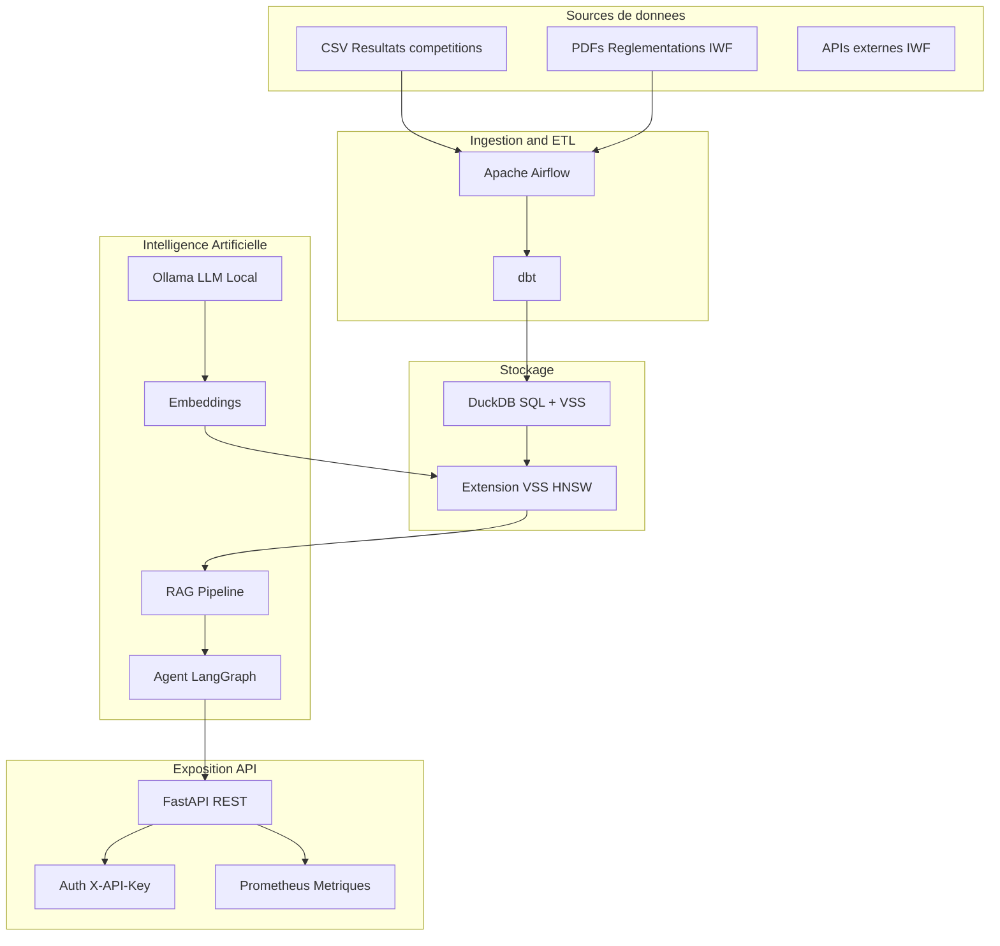

# IWF AI Hub

AI platform for the International Weightlifting Federation (IWF).
Data + AI architecture with Docker Compose for scalability
and data sovereignty.

---

## Business problem

The IWF manages a growing volume of data (competition results, anti-doping regulations,
athlete history) across PDFs and heterogeneous databases.

**Goals :**
- Centralize and structure IWF data (modern ETL)
- Enable natural language query of regulations (RAG)
- Provide a conversational AI agent for analysts and coaches
- Guarantee data sovereignty (on-premise / sovereign cloud infrastructure)

---

## Architecture


```mermaid
graph TB

    subgraph DataSources["Sources de donnees"]
        PDF[PDFs Reglementations IWF]
        CSV[CSV Resultats competitions]
        API_EXT[APIs externes IWF]
    end

    subgraph Ingestion["Ingestion and ETL"]
        AIRFLOW[Apache Airflow]
        DBT[dbt]
    end

    subgraph Storage["Stockage"]
        DUCKDB[DuckDB SQL + VSS]
        VSS[Extension VSS HNSW]
    end

    subgraph AI["Intelligence Artificielle"]
        OLLAMA[Ollama LLM Local]
        EMBED[Embeddings]
        RAG[RAG Pipeline]
        AGENT[Agent LangGraph]
    end

    subgraph API["Exposition API"]
        FASTAPI[FastAPI REST]
        AUTH[Auth X-API-Key]
        MONITOR[Prometheus Metriques]
    end

    CSV --> AIRFLOW
    PDF --> AIRFLOW
    AIRFLOW --> DBT
    DBT --> DUCKDB

    DUCKDB --> VSS
    VSS --> RAG
    OLLAMA --> EMBED
    EMBED --> VSS
    RAG --> AGENT

    AGENT --> FASTAPI
    FASTAPI --> AUTH
    FASTAPI --> MONITOR
```

---

## Stack Technique

| Composant | Technologie | Role | Environnement |
|---|---|---|---|
| Orchestration | Apache Airflow | DAGs ETL, scheduling | Docker |
| Transformation | dbt + DuckDB | Star Schema | Container (via Airflow) |
| Traitement distribue | PySpark | Miroir Silver (Phase 2.5) | Docker / venv dedie |
| Base de donnees | DuckDB + VSS | SQL + Vector Search | Container |
| LLM and Embeddings | Ollama | LLM local, souverainete | Container |
| Agent IA | LangGraph | Workflow conversationnel | .venv |
| API | FastAPI | Exposition REST | .venv / Container |
| Conteneurisation | Docker + Compose | Dev local | Local |
| Monitoring | Prometheus/Grafana | Observabilite | Docker |

---

## Structure du projet

```
iwf-ai-hub/
│
├── dags/                             # Airflow Workflows
│   ├── dag_etl_results.py
│   └── dag_ingest_rules.py
│
├── dbt/                              # Transformation Layer
│   ├── dbt_project.yml
│   ├── profiles.yml
│   └── models/
│       ├── sources.yml
│       ├── staging/
│       │   └── stg_results.sql
│       └── marts/
│           ├── dim_athletes.sql
│           ├── dim_weight_classes.sql
│           ├── fct_results.sql
│           └── schema.yml
│
├── src/                              # Source Code
│   ├── db/
│   │   └── init.sql
│   ├── pipelines/
│   │   ├── extract_results.py
│   │   ├── load_pdfs.py
│   │   ├── chunking.py
│   │   ├── embeddings.py
│   │   └── retrieval.py
│   ├── agent/                        # Phase 4 - Agent LangGraph
│   │   ├── graph.py
│   │   ├── state.py
│   │   └── tools.py
│   └── api/                          # Phase 5 - API FastAPI
│       ├── config.py
│       ├── dependencies.py
│       ├── main.py
│       └── models.py
│
├── tests/
│   ├── conftest.py
│   ├── test_etl.py
│   ├── test_etl_ow.py
│   └── test_rag.py
│
├── notebooks/                         # Phase 2.5 (planned)
│   ├── silver_lifters.ipynb
│   └── validate_parity.ipynb
│
├── ingestion/                         # Phase 7 (planned)
│   ├── upload_bronze.py
│   └── README.md
│
├── data/
│   ├── pdfs/
│   └── duckdb/
│
├── requirements/
│   ├── base.txt
│   └── airflow.txt
│
├── .env.example
├── docker-compose.yaml
├── Dockerfile
└── README.md
```

---

> **DuckDB VSS note** : To build an HNSW index use
> `SET hnsw_enable_experimental_persistence = true;` after `LOAD vss;`
> (in `src/db/init.sql`).
> The HNSW index does not persist across DuckDB sessions.

> **Sources PDF IWF** : URL dans `dags/dag_ingest_rules.py` :
> `https://www.iwf.net/wp-content/uploads/downloads/2024/01/IWF_TCRR_2024.pdf`

## Quick Start

### Pre-requis

- Python 3.11+
- DuckDB (extension VSS activee)
- Ollama avec les modeles `nomic-embed-text` et `llama3.2`
- Docker et Docker Compose (pour l'ETL Airflow)

### Option 1 : Docker Compose (developpement local)

```bash
git clone https://github.com/gautbl/iwf-ai-hub.git
cd iwf-ai-hub
docker-compose up -d
curl http://localhost:8080/health
curl http://localhost:11434/api/tags
```

### Option 2 : API FastAPI (developpement local)

```bash
.venv\Scripts\activate  # Windows
uvicorn src.api.main:app --reload
curl http://localhost:8000/health
```

L'API expose deux endpoints :
- `GET /health` : etat de sante (DuckDB, Ollama)
- `POST /chat` : conversation avec l'agent IWF

---

## Roadmap

Phase | Component | Status | Description |
|---|---|---|---|
| Phase 1 | Docker Infrastructure | Done | Airflow, DuckDB, Ollama |
| Phase 2 | ETL Pipeline | Done | dbt, Star Schema, tests |
| Phase 3 | RAG Pipeline | Done | PDFs, chunking, embeddings, retrieval |
| Phase 4 | LangGraph Agent | Done | Tools, memory, workflow |
| Phase 5 | FastAPI API | Done | REST, auth, monitoring |
| Phase 6 | Kubernetes | Coming | Migration, Helm, CI/CD |
| Phase 2.5 | PySpark Silver Mirror | Optional | Transformation + parity validation |
| Phase 7 | Ingestion Layer | Optional | MinIO + boto3 |

---

## License
MIT - Open source personal project